# sentinel1_level0
  
Analysis of Sentinel1 level 0 data for decoding raw data, inspired by
the results shown in "Identification of C-Band Radio Frequency Interferences 
from Sentinel-1 Data" at https://www.mdpi.com/2072-4292/9/11/1183 and summarized in a presentation
at the European GNU Radio Days 2021 available at http://jmfriedt.free.fr/gnuradiodays_setinel1_level0.mp4 with the slides at http://jmfriedt.free.fr/slides_sentinel_raw.pdf.

This software might possibly be used as a prequel to https://multiply-sar-pre-processing.readthedocs.io/en/master/

This C software inspired a Python version of the decoder found at https://github.com/Rich-Hall/sentinel1decoder with an amazing demonstration of full range-azimuth compression of the level-0 Sentinel1 data at https://nbviewer.org/github/Rich-Hall/sentinel1Level0DecodingDemo/blob/main/sentinel1Level0DecodingDemo.ipynb including the ability to decode ephemeris and metadata in the header which are not handled here, and the ability to select which packet is decoded.

<h1>Compilation</h1>
  
Working on a GNU/Linux computer (Debian/sid but only using basic functionalities so any distribution
should do), type ``make`` to compile (tested using gcc 10.2.1). Execute by providing to ``read_file`` 
as argument the dataset to be processed, e.g.
```
./read_file S1A_IW_RAW__0SDV_20210112T173201_20210112T173234_036108_043B95_7EA4.SAFE/s1a-iw-raw-s-vv-20210112t173201-20210112t173234-036108-043b95.dat   
```
The result will be a display of the various decoded fields and binary files ``result*.bin`` with
``*`` including the swath index and coarse GPS time to separate all contributions. These files
are to be processed using GNU/Octave by running the ``read_bin.m`` script. At the moment this script
will take as options the filename, NQ the number of data to be processed (range direction) and the number
of lines to be processed (azimuth direction). The number of samples in the range direction is twice the NQ field
when decoding. Please help find an easier way to process the generated dataset, especially in the case of multiple
swaths to be assembled (IW datasets).

**Please notice that the ``read_bin.m`` script completes with a ``return`` statement at line 67, not displaying any figure, since for the general case the pulse shape must be provided (either identified from a point-like source or computed, see https://github.com/jmfriedt/sentinel1_level0/issues/3 for some hints in that direction). In case you are testing with the Sao Paulo dataset and would like to display the range-azimuth compressed maps, please comment this ``return`` statement line.**

<h1>Current status and understanding on decoding</h1>

*Thanks to the sharp analysis of Nicolas Desiderio Gonzalez Alonso De Linaje at the 
Technical University of Denmark, the software has now been compared with the reference
dataset provided by ESA (see reference_dataset directory) and it is believed that the
remaining processing bugs have been removed (Nov. 2021). The text below represents the
initial line of thought that led to Sentinel1 Level0 decoding software.*

CCSDS is a well documented protocol a bit challenging to get familiar with, as
was discussed earlier when decoding Meteor M2 weather satellite images
(https://archive.fosdem.org/2019/schedule/event/sdr_meteorm2n/). Here the error
correction seems to have already been applied after radiofrequency communication but
the data is compressed (payload must be Huffman decoded). 

The most important document is arguably the Sentinel-1 SAR Space Packet Protocol Data 
Unit found at https://sentinel.esa.int/documents/247904/2142675/Sentinel-1-SAR-Space-Packet-Protocol-Data-Unit.pdf/d47f3009-a37a-43f9-8b65-da858f6fb1ca?t=1547146144000. To make sure you do not miss the awkward bit organization in this document as I did, 
I highlight below that all charts are drawn with the most significant bit (MSb) to the left, indexed 0 (?!)

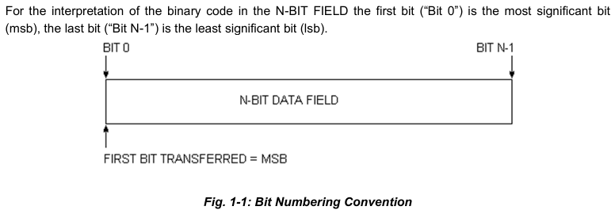

Example of raw file analysis output and its interpretation (primary and secondary header):

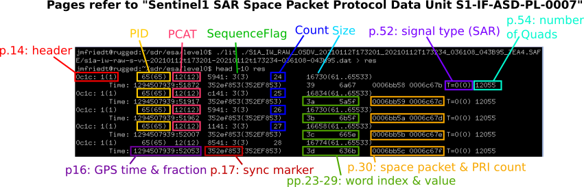

Page numbers refer to "SAR Space Packet Protocol Data Unit" found in the doc folder.

The reference dataset is descrived in section 5.3 of https://sentinels.copernicus.eu/documents/247904/685163/Sentinel-1-Level-0-Data-Decoding-Package.pdf (Sentinel-1 Level-0 Data Decoding Package). 
Be aware that the archive is huge (38260338024 bytes).

The same processing algorithm on the reference dataset leads to

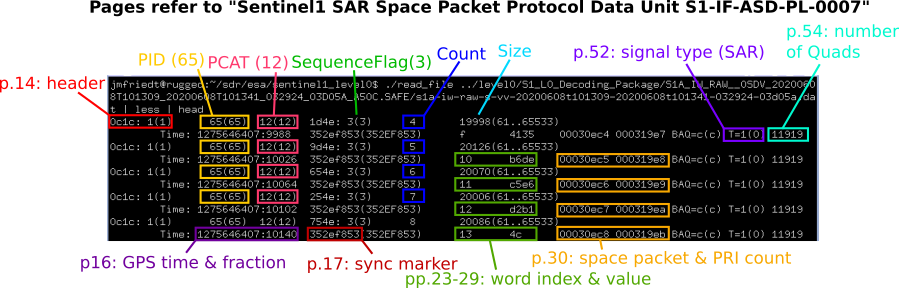

Once the file format was assessed, the Huffman compressed data must be uncompressed. 
Although multiple encoding mode can be used depending on operating conditions of 
Sentinel1, we focus on FDBAQ/type D [1,2] which seems to be the operational case. After 
processing a dataset (S1A_IW_RAW__0SDV_20210112T173201_20210112T173234_036108_043B95_7EA4.SAFE)
the following picture is obtained

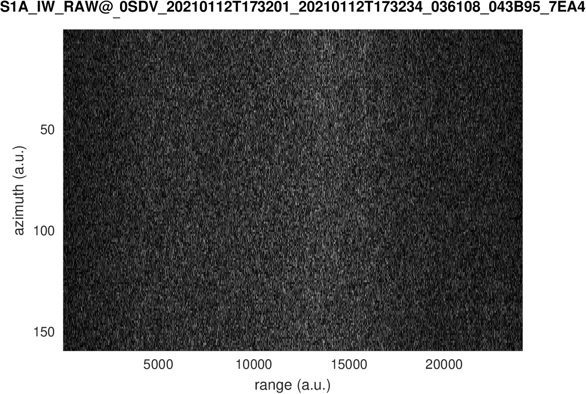

which does not seem inconsistent with a noise-like pattern prior to range compression. 
Reading the whole file, excluding the calibration packets and focusing solely on 
echo packets (type 0), we obtain the packet length according to the following chart: 

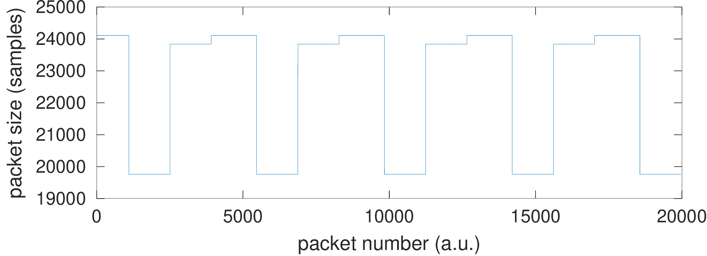

which we interpret as three swaths (IW mode) sequentially acquiring the 7 bursts, with here
up to five shown. Displaying the data associated with each burst (averaging over two adjacent
lines vertically and 4 columns vertically to reduce the number of samples displayed in the image)
hints at some consistent structure

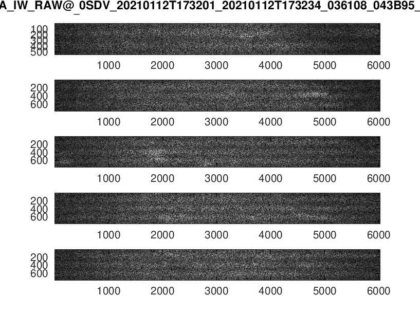

The top figure (1st of five) is the same as the image shown above. If the
comparison is relevant, below is the result of processing the matching Level1 dataset provided
by ESA with SNAP (swath IW2 consistent with the decimation code 11 identified for the raw
datasets displayed above, bursts 1 to 9 despite only 5 being supposedly displayed above).

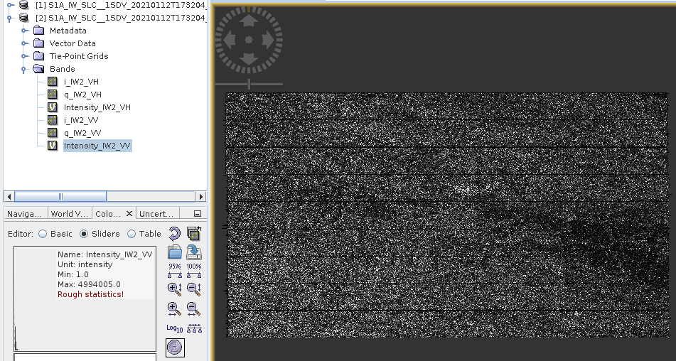

Following the idea discussed in [2], we plot the BRC index which represents the compression 
efficiency depending on the features of the collected data, with more bits allocated to areas 
with more structures. Again, some spatial consistency is observed:

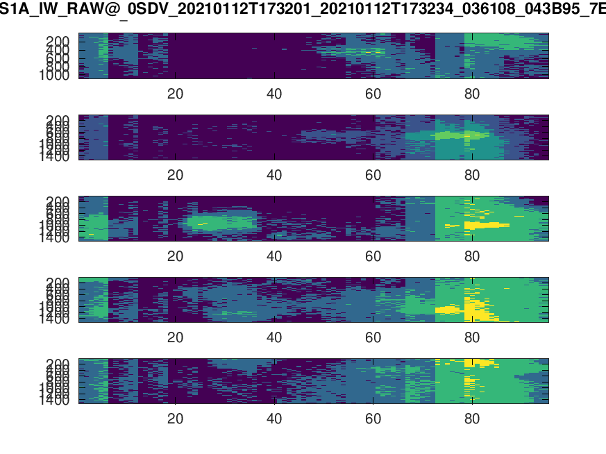

Assuming the raw data we collected has been correctly decoded, we wish to consider the 
chirp shape to synthesize a local copy and cross-correlate each time-series for range
compression. The sampling rate (code 0x0b in register 40) is fdec=16/11.fref with
fref=37.53472224 MHz or 54.596 MS/s, the pulse ramp rate is TXPRR(code)=0x8488 or an Up-Chirp at a 
rate of ``1160xfref^2/2^21=779.3 kHz/us`` starting at TXPSF(code)=0x2932 converted to 
``TXPSF=[TXPRR(code)/2^23+TSPSF(code)/2^14]*fref=(1160/2^23-10531/2^14)*37.53472224=-24 MHz``
I assume this is the baseband frequency of the chirp with respect to the 5405 MHz carrier frequency
after its removal during acquisition.

<h1>Pulse compression</h1>

Assuming we have correctly decoded the {I,Q} stream and are plotting the raw {range,azimuth}
maps, we might want to consider range and then azimuth compression. Range compression relies on
generating a local copy of the emitted chirp (whose bandwidth defines the inverse of the
range resolution) and cross-correlating the received time series with this chirp. The chirp
parameters are transmitted by Sentinel 1 as part of the messages and the Tx Pulse Sample
Rate (TXPRR), Tx Pulse Start Frequency (TXPSF) and Tx Pulse Length (TXPL) at offsets 40 to 48
hold all the needed information (notice that TXPL is a 24 bit value and it could be that
my handling of the endianness by going through a 32-bit value handling is not endian agnostic).

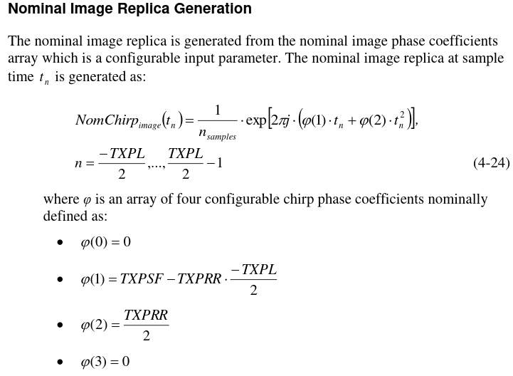

Section 4.2.1.1 page 32 (above) of Level 1 Detailed Algorithm Definition at
https://sentinel.esa.int/documents/247904/1877131/Sentinel-1-Level-1-Detailed-Algorithm-Definition
provides the chirp equation based on these quantities. The file we decoded states that for our IW2,
TXPSF=-10546 and TXPRR=1160 (Upward chirp) and TXPL=2327 and agrees with the analysis of the file
with https://github.com/plops/cl-cpp-generator2/tree/master/example/33_copernicus_gtk:

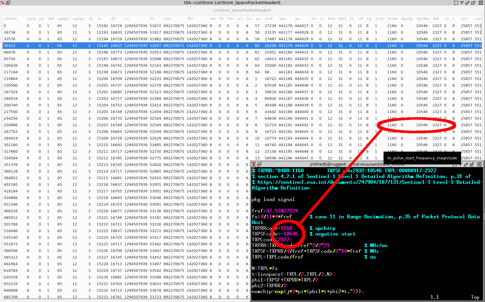

Since we also know the sampling
rate fs=4/11x4xfref (case 11 in Range Decimation, p.35 of Packet Protocol Data Unit) and 
fref=37.53472224 we can create synthetic time as ``N=TXPL*fs;t=linspace(-TXPL/2,TXPL/2,N);``
and follow the phase equation provided above to compute the chirp. The evolution of the phase,
unwrapped phase and frequency as derivate of the phase is shown below and consistent with a linear
chirp

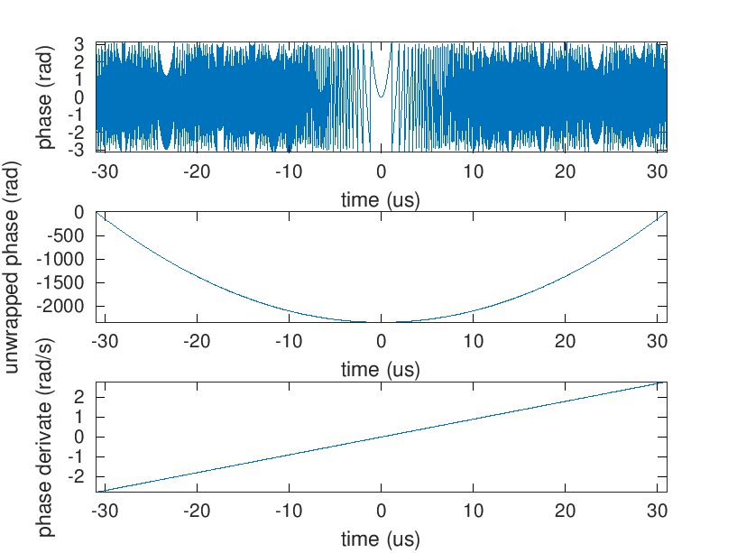

The result of the 
correlation with the resulting chirp is shown below, which does look like a proper pulse 
compression:

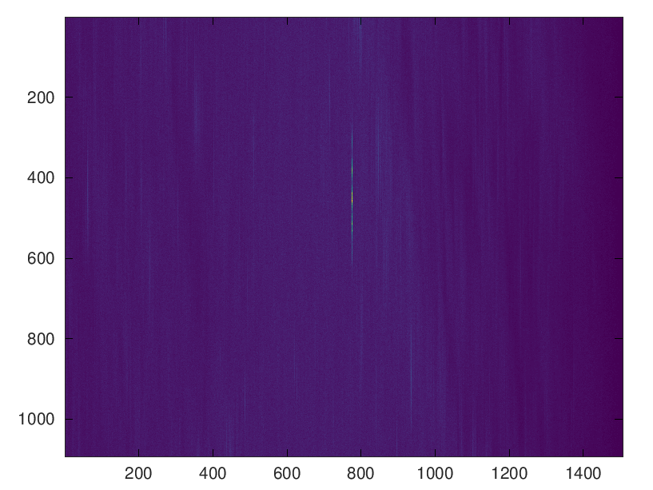

<h1>Point-like target: the Sao Paolo dataset</h1>

Consensus seems to be that range/azimuth compression is best assessed on point like targets
over flat surfaces, namely ships at sea. The dataset we consider is the port of Sao Paolo
in Brazil with the files found at S1B_IW_RAW__0SDV_20210216T083028_20210216T083100_025629_030DEF_1684.zip (raw level 0 data) and 
S1B_IW_SLC__1SDV_20210216T083030_20210216T083058_025629_030DEF_68C4.zip
(level 1 data).

Downloading the Level1 preview image S1B_IW_SLC__1SDV_20210216T083030_20210216T083058_025629_030DEF_68C4-ql.jpeg from the ESA web site

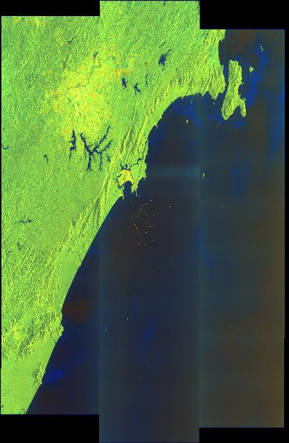

clearly shows the waiting ships best visible on the middle swath identified as IW2 which we shall
focus on, and the individual ships waiting at sea are visible in the SNAP display of the Level1 dataset:

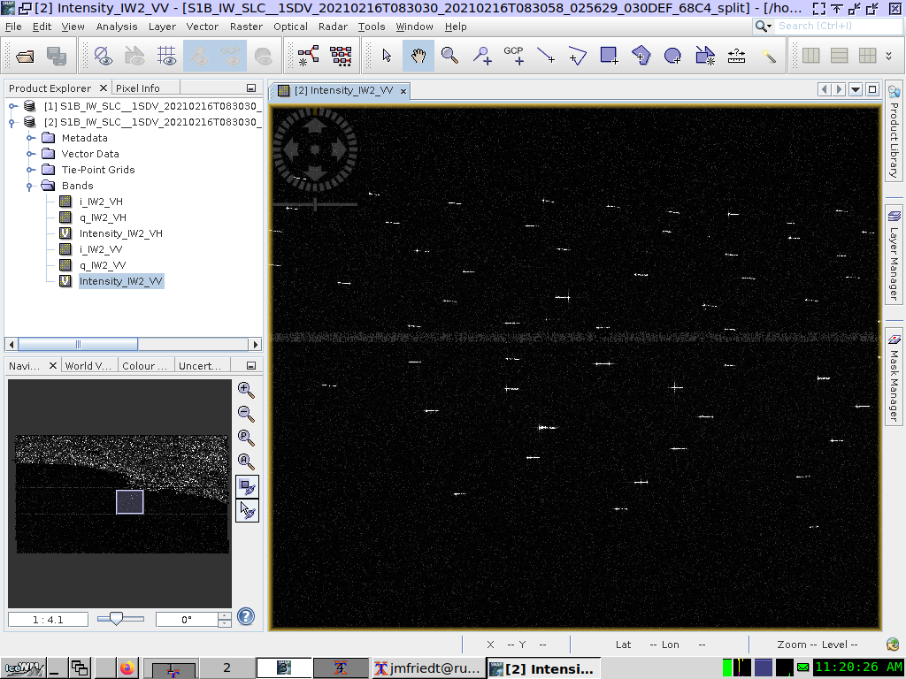

Processing this dataset for compression rate (BRC) again demonstrates that we probably understand the encoding procedure

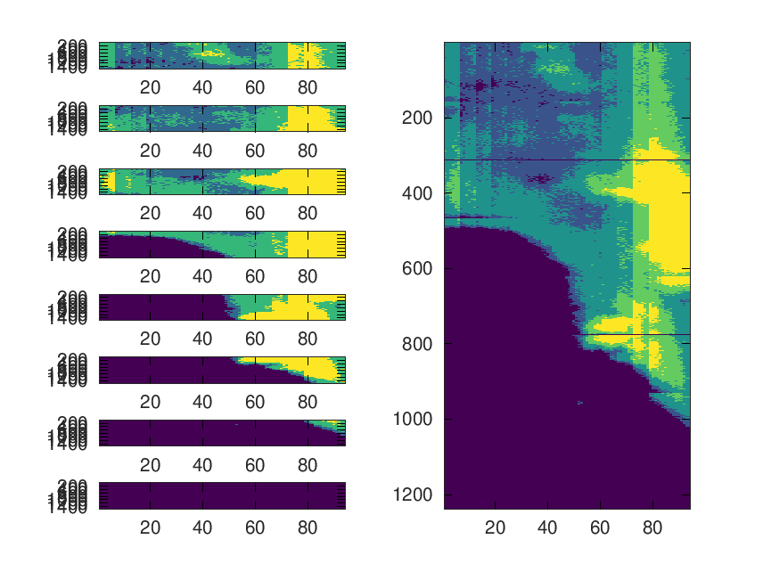

and


prior to compression, but most interesting is analyzing a line after range compression 
(applying the chirp
equation from the decoded parameters) here displaying the phase of the complex coefficient
as a function of azimuth position

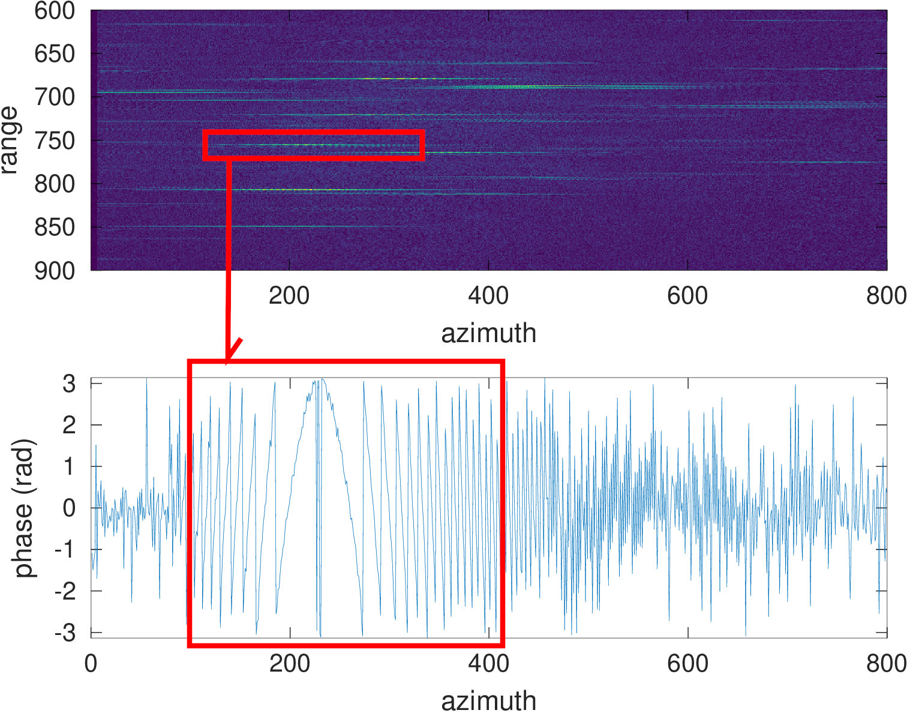

My current understanding is that this phase should be linear and something should be done to 
remove this parabolic dependency of the phase with position before the FFT can compress
the signal along the azimuth.

<h1>Point-like target: the Sao Paolo StripMap (SM) dataset</h1>

In order to avoid the Doppler shift introduced by sweeping the RADAR beam along the swath
in EW or IW mode, we consider a simpler StripMap (SM) acquisition over the harbour of Sao Paolo.
Again the decoded CCSDS sentences are consistent with swath 6 being acquired (as stated
in the name of the dataset we fetched from Copernicus Scihub ``S1A_S6_RAW__0SDV_20210226T214354_20210226T214424_036766_045287_FD68.SAFE``)

Since this dataset was mostly collected over sea the BRC map is not very exciting with relevant
features

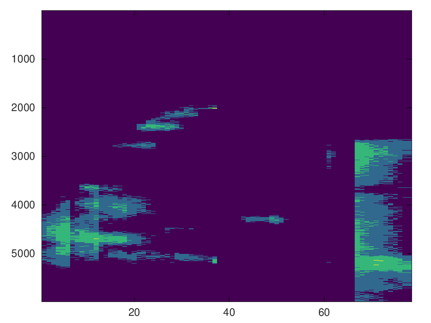

and prior to any compression the image is rather blurred as expected from the pulse spreading along
range and azimuth data

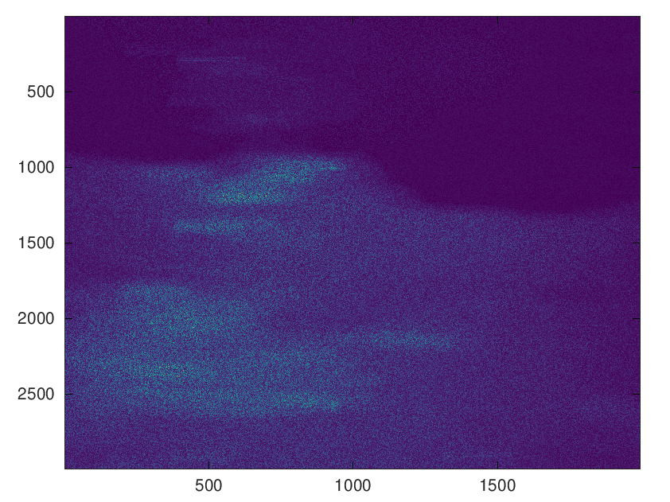

Range compression is readily achieved with the chirp shape published along the Sentinel1 
sentences defining start frequency, chirp duration and direction:

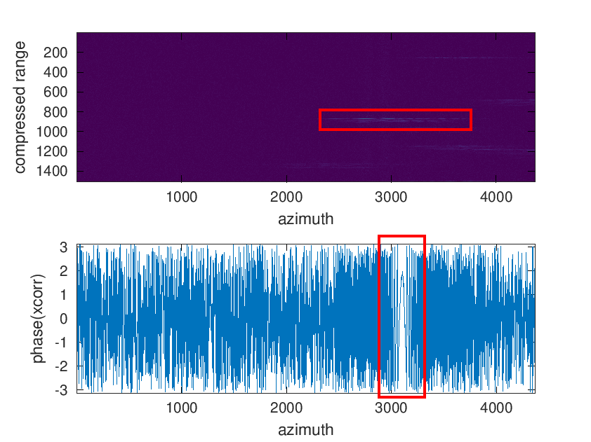

and yet range compression remains elusive. Here we have sampled the chirp *along the azimuth* direction of the most powerful reflector, assumed being point-like, and have correlated the whole image with
this chirp shape. Why the pulse is a chirp along azimuth and not a linear phase evolution remains
an open question to this investigator

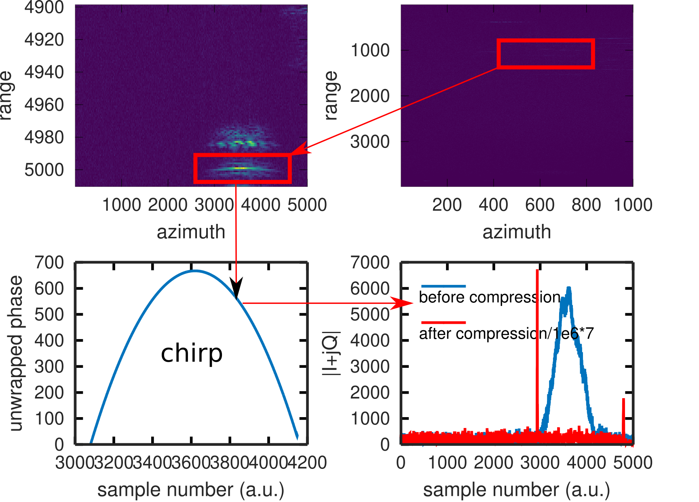

Applying the azimuth compression over the whole harbour seems to compress all ships to single pixel
reflectors:

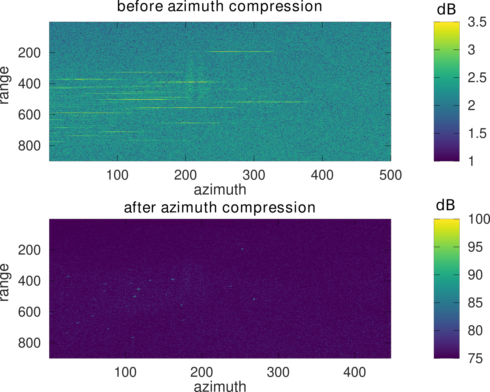

Processing the huge datasets in a single step is beyond the capability of the author's CF-19 laptop computer fitted with
12 GB RAM. The software was updated to save multiple binary files indexed with the Swath number and acquisition (GPS) time 
(in second). The result, with comparison with the SNAP software output of a StripMap (SM6) dataset of Sao Paolo harbour,
is exhibited below

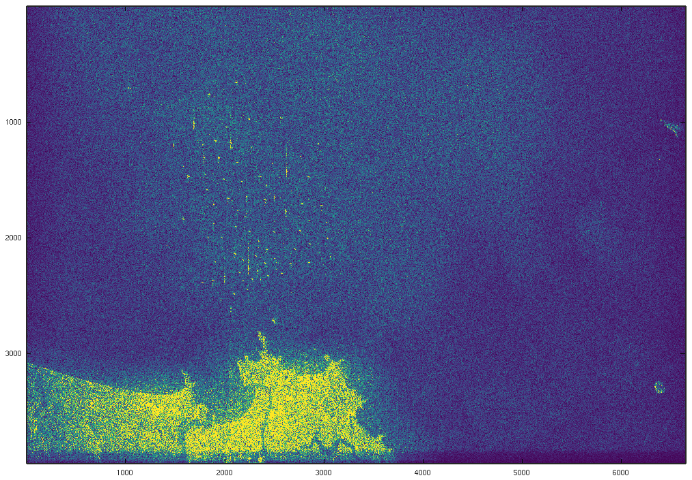

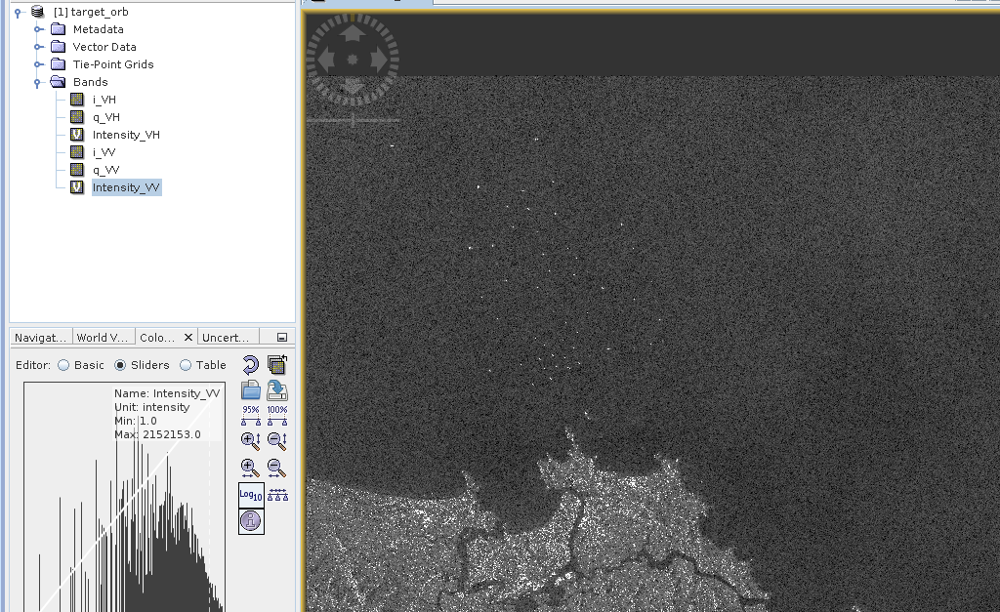

<h1>Calibration packets</h1>

The whole purpose of this investigation was accessing the Level 0 raw packets to decode
signals as Sentinel1 is listening only. We could probably have started with that, but now that
FDBAQ is decoded correctly, decoding the Data Format A (Bypass) is quite trivial as long
as we do not mess up with filler bits. As mentioned in the documentation, NW the number of words
used to process calibration data is fixed so we can actually just increment the pointer whenever
the NQ complex data have been read. We have decided the read bytes 5 by 5 since 5x8=40 which
is aligned with the 10-bit long data format. The resulting .bin files can be read using the 
GNU/Octave ``read_bin_cal.m`` providing as argument the NQ number of samples/line (remember to
double the value stored in the filename as Even and Odd samples are read sequentially, meaning
twice as many samples as indicated) and the number of lines. An example of resulting chart is 
provided below, emphasizing the consistency and reproducibility of the results.

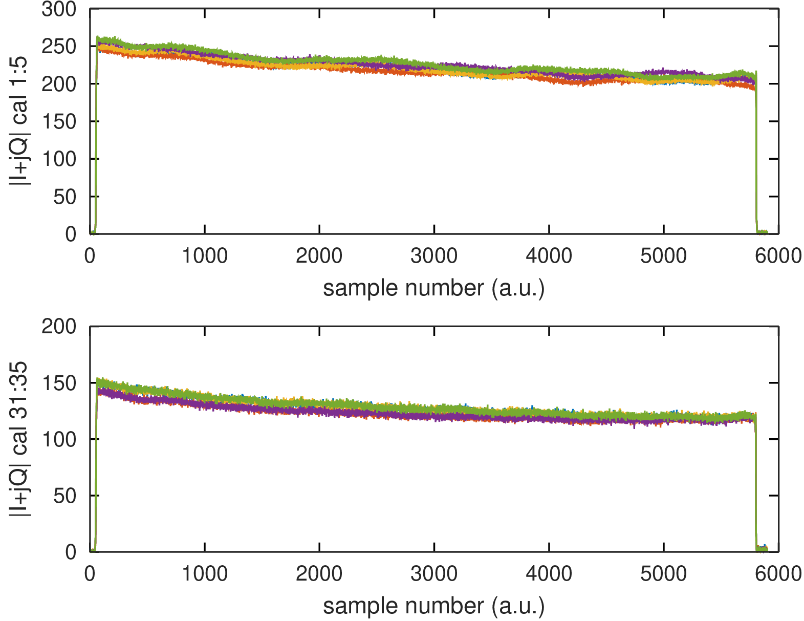

<h1>Conclusion</h1>

Our original objective was reproducing the long strip of data acquisition over Europe
for radiometric measurement using the raw Sentinel 1 data. We believe this result is now
achieved as demonstrated in the following chart

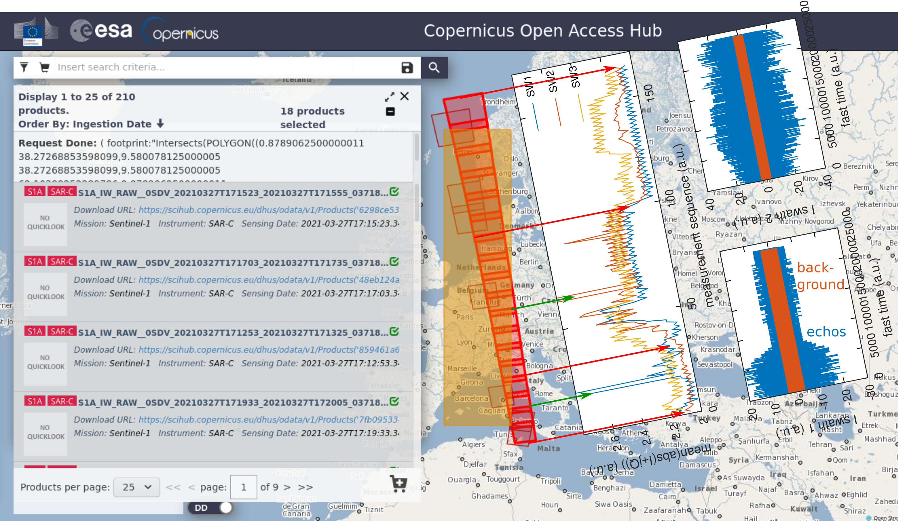

generated using the <a href="./2103_europe_results/go.m">script</a> assuming all
datasets have been fetched from the ESA Copernicus web site (29 GB) and processed
using the software described above (150 GB).

As a sequel to their original work on EMI detection from space, the same authors published 
<a href="https://www.sciencedirect.com/science/article/abs/pii/S0034425721005861">Passive sensing by Sentinel-1 SAR: Methods and applications (Remote Sensing of Environment, March 2022)</a> which should be reproducible with this software.

<h1>TODO</h1>

After processing 18 raw datasets of a Sentinel1 flight over western europe, taking forever to 
generate outputs, it seems clear that a multithreaded approach would increase speed as seen on SNAP
(with the caveat of keeping CPU usage and memory requirement reasonable, which is NOT the case of SNAP !).
Since each chunck of data is processed independently of neighbours, this parallelization seems quite
obvious to implement.

<B>Edit</B> (2022/10/30): not so obvious since each burst within each swath does not align with CCSDS packets so that multiple threads mighe be decoding parts of the same burst and must make sure to order properly their output when writing to file.

<h1>Acknowledgement</h1>

This result could not have been achieved without the sample code provided at
https://github.com/plops/cl-cpp-generator2/blob/master/example/08_copernicus_radar/source/
whose output and probing variable values was invaluable for debugging cases I had not 
thought of.

[1] E. Attema & al., Sentinel-1 Flexible Dynamic Block Adaptive Quantizer, Proc. 8th European Conference on Synthetic Aperture Radar (EUSAR), July 2010 at 
https://www.researchgate.net/publication/224233683_Sentinel-1_Flexible_Dynamic_Block_Adaptive_Quantizer

[2] P. Guccione & al., Sentinel-1A: Analysis of FDBAQ Performance on Real Data, IEEE 
Transactions on Geoscience and Remote Sensing, December 2015, DOI: 10.1109/TGRS.2015.2449288 at 
https://www.researchgate.net/publication/281607948_Sentinel-1A_Analysis_of_FDBAQ_Performance_on_Real_Data
