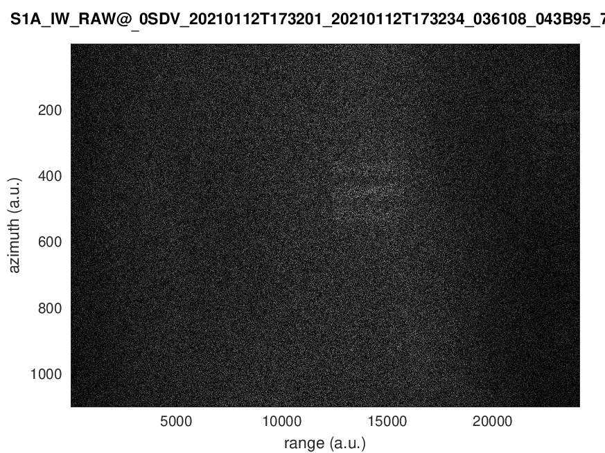
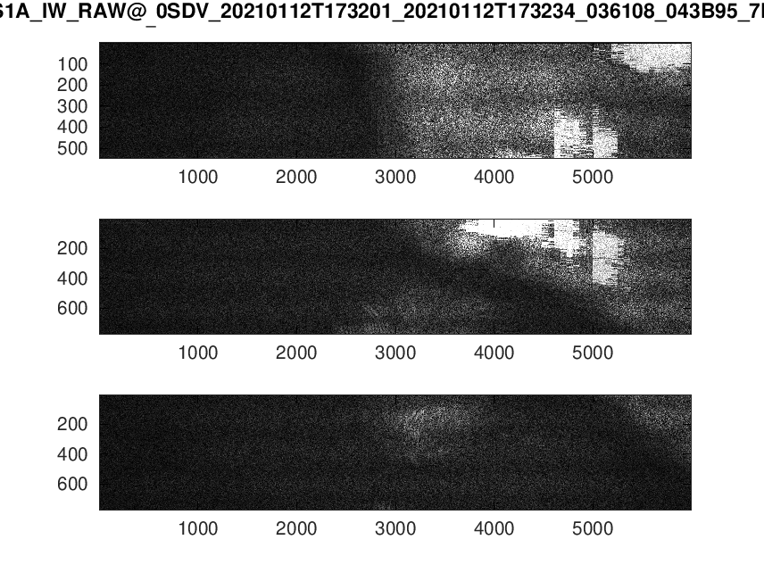

# sentinel1_level0
  
Analysis of Sentinel1 level 0 data for decoding raw data, inspired by
the results shown in "Identification of C-Band Radio Frequency Interferences 
from Sentinel-1 Data" at https://www.mdpi.com/2072-4292/9/11/1183

<h1>Compilation</h1>
  
Working on a GNU/Linux computer (Debian/sid but only using basic functionalities so any distribution
should do), type ``make`` to compile (tested using gcc 10.2.1). Execute by providing to ``read_file`` 
as argument the dataset to be processed, e.g.
```
./read_file S1A_IW_RAW__0SDV_20210112T173201_20210112T173234_036108_043B95_7EA4.SAFE/s1a-iw-raw-s-vv-20210112t173201-20210112t173234-036108-043b95.dat   
```
The result will be a display of the various decoded fields and a file ``result.dat`` to be 
processed with GNU/Octave. The number of rows is missing at the moment from the header and
must be inserted manually as the result of ``grep -v ^# result.dat | wc -l``. In GNU/Octave,
``load result.dat`` and ``imagesc(abs(x))`` generated the figure displayed at the bottom
of this page.

<h1>Current status and understanding on decoding</h1>

CCSDS is a well documented protocol a bit challenging to get familiar with, as
was discussed earlier when decoding Meteor M2 weather satellite images
(https://archive.fosdem.org/2019/schedule/event/sdr_meteorm2n/). Here the error
correction seems to have already been applied after radiofrequency communication but
the data is compressed (payload must be Huffman decoded). 

The most important document is arguably the Sentinel-1 SAR Space Packet Protocol Data 
Unit found at https://sentinel.esa.int/documents/247904/2142675/Sentinel-1-SAR-Space-Packet-Protocol-Data-Unit.pdf/d47f3009-a37a-43f9-8b65-da858f6fb1ca?t=1547146144000. To make sure you do not miss the awkward bit organization in this document as I did, 
I highlight below that all charts are drawn with the most significant bit (MSb) to the left, indexed 0 (?!)


Example of raw file analysis output and its interpretation (primary and secondary header):


Page numbers refer to "SAR Space Packet Protocol Data Unit" found in the doc folder.

The reference dataset is descrived in section 5.3 of https://sentinels.copernicus.eu/documents/247904/685163/Sentinel-1-Level-0-Data-Decoding-Package.pdf (Sentinel-1 Level-0 Data Decoding Package). 
Be aware that the archive is huge (38260338024 bytes).

The same processing algorithm on the reference dataset leads to


Once the file format was assessed, the Huffman compressed data must be uncompressed. 
Although multiple encoding mode can be used depending on operating conditions of 
Sentinel1, we focus on FDBAQ/type D [1,2] which seems to be the operational case. After 
processing a dataset (S1A_IW_RAW__0SDV_20210112T173201_20210112T173234_036108_043B95_7EA4.SAFE)
the following picture is obtained



which does not seem inconsistent with a noise-like pattern prior to range compression. 
Reading the whole file, excluding the calibration packets and focusing solely on 
echo packets (type 0), we obtain the packet length according to the following chart: 


which we interpret as three swaths (IW mode) sequentially acquiring the 7 bursts, with here
up to five shown. Displaying the data associated with each burst (averaging over two adjacent
lines vertically and 4 columns vertically to reduce the number of samples displayed in the image)
hints at some consistent structure


The top figure (1st of five) is the same as the image shown above. If the
comparison is relevant, below is the result of processing the matching Level1 dataset provided
by ESA with SNAP (swath IW2 consistent with the decimation code 11 identified for the raw
datasets displayed above, bursts 1 to 9 despite only 5 being supposedly displayed above).


Following the idea discussed in [2], we plot the BRC index which represents the compression 
efficiency depending on the features of the collected data, with more bits allocated to areas 
with more structures. Again, some spatial consistency is observed:


Assuming the raw data we collected has been correctly decoded, we wish to consider the 
chirp shape to synthesize a local copy and cross-correlate each time-series for range
compression. The sampling rate (code 0x0b in register 40) is fdec=16/11.fref with
fref=37.53472224 MHz or 54.596 MS/s, the pulse ramp rate is TXPRR=0x8488 or an Up-Chirp at a 
rate of 1160xfref^2/2^21=779.3 kHz/us starting at TXPSF=0x2932=10546xfref/2^14=24.16 MHz added
to TXPRR/(4fref)=5190.5 MHz ... which is out of the C-band RADAR of Sentinel1. WORK IN PROGRESS ...

This result could not have been achieved without the sample code provided at
https://github.com/plops/cl-cpp-generator2/blob/master/example/08_copernicus_radar/source/
whose output and probing variable values was invaluable for debugging cases I had not 
thought of.

<h1>Pulse compression</h1>

Assuming we have correctly decoded the {I,Q} stream and are plotting the raw {range,azimuth}
maps, we might want to consider range and then azimuth compression. Range compression relies on
generating a local copy of the emitted chirp (whose bandwidth defines the inverse of the
range resolution) and cross-correlating the received time series with this chirp. The chirp
parameters are transmitted by Sentinel 1 as part of the messages and the Tx Pulse Sample
Rate (TXPRR), Tx Pulse Start Frequency (TXPSF) and Tx Pulse Length (TXPL) at offsets 40 to 48
hold all the needed information (notice that TXPL is a 24 bit value and it could be that
my handling of the endianness by going through a 32-bit value handling is not endian agnostic).


Section 4.2.1.1 page 32 (above) of Level 1 Detailed Algorithm Definition at
https://sentinel.esa.int/documents/247904/1877131/Sentinel-1-Level-1-Detailed-Algorithm-Definition
provides the chirp equation based on these quantities. The file we decoded states that for our IW2,
TXPSF=-10546 and TXPRR=1160 (Upward chirp) and TXPL=2327 and agrees with the analysis of the file
with https://github.com/plops/cl-cpp-generator2/tree/master/example/33_copernicus_gtk:


Since we also know the sampling
rate fs=4/11*4*fref (case 11 in Range Decimation, p.35 of Packet Protocol Data Unit) and 
fref=37.53472224 we can create synthetic time as ``N=TXPL*fs;t=linspace(-TXPL/2,TXPL/2,N);``
and follow the phase equation provided above to compute the chirp. The evolution of the phase,
unwrapped phase and frequency as derivate of the phase is shown below and consistent with a linear
chirp


The result of the 
correlation with the resulting chirp is shown below, which does look like a proper pulse 
compression:


<h1>Point-like target: the Sao Paolo dataset</h1>

Consensus seems to be that range/azimuth compression is best assessed on point like targets
over flat surfaces, namely ships at sea. The dataset we consider is the port of Sao Paolo
in Brazil with the files found at S1B_IW_RAW__0SDV_20210216T083028_20210216T083100_025629_030DEF_1684.zip (raw level 0 data) and 
S1B_IW_SLC__1SDV_20210216T083030_20210216T083058_025629_030DEF_68C4.zip
(level 1 data)

Downloading the Level1 preview image S1B_IW_SLC__1SDV_20210216T083030_20210216T083058_025629_030DEF_68C4-ql.jpeg from the ESA web site


clearly shows the waiting ships. Processing this dataset for compression rate (BRC) again
demonstrates that we probably understand the encoding procedure


and



prior to compression, but most interesting is analyzing a line after range compression 
(applying the chirp
equation from the decoded parameters) here displaying the phase of the complex coefficient
as a function of azimuth position


My current understanding is that this phase should be linear and something should be done to 
remove this parabolic dependency of the phase with position before the FFT can compress
the signal along the azimuth.

[1] E. Attema & al., Sentinel-1 Flexible Dynamic Block Adaptive Quantizer, Proc. 8th European Conference on Synthetic Aperture Radar (EUSAR), July 2010 at 
https://www.researchgate.net/publication/224233683_Sentinel-1_Flexible_Dynamic_Block_Adaptive_Quantizer

[2] P. Guccione & al., Sentinel-1A: Analysis of FDBAQ Performance on Real Data, IEEE 
Transactions on Geoscience and Remote Sensing, December 2015, DOI: 10.1109/TGRS.2015.2449288 at 
https://www.researchgate.net/publication/281607948_Sentinel-1A_Analysis_of_FDBAQ_Performance_on_Real_Data
