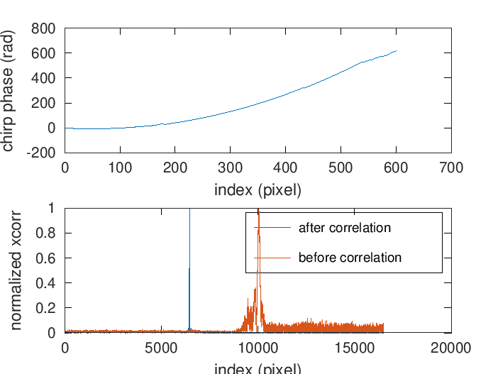
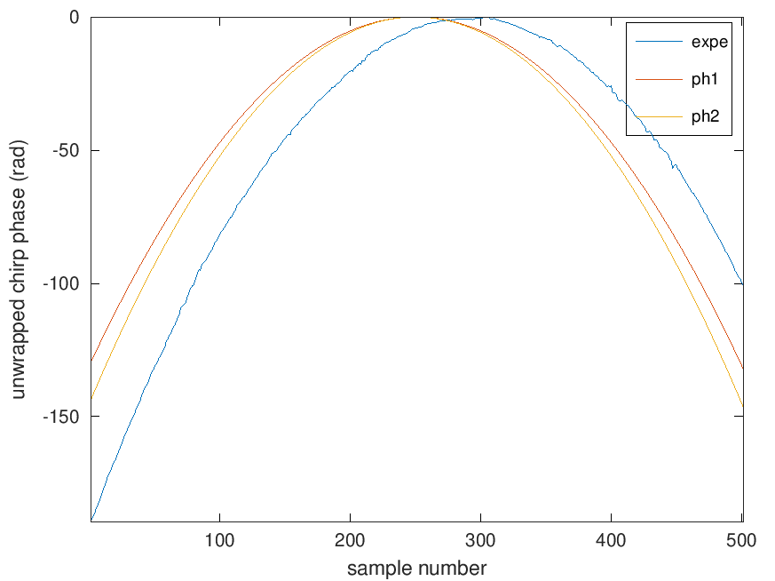
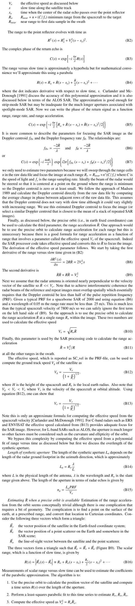

1. decode the raw level0 stripmap datasets acquired over Sao Paulo:

```bash
../read_file ./S1A_S6_RAW__0SDV_20210226T214354_20210226T214424_036766_045287_FD68.SAFE/s1a-s6-raw-s-vv-20210226t214354-20210226t214424-036766-045287.dat > output.txt
```

No need to leave the whole stripmap dataset decode, the first 5 GB is more than
enough
```bash
5933337648 Aug  4 14:47 resultSW06_T1298411052_NQ9975.bin
```

2. Process the dataset, first with range compression using the theoretical chirp
along range from SM6 (StripMap 6 parameters), identify the strongest target 
and azimuth compress using this chirp
```Octave
[x,xx]=read_bin_sm('resultSW06_T1298411052_NQ9975.bin',floor(1500*11), 19950);
```




3. As shown in ``cmp_pulse.m``, the theoretical azimuth chirp is properly predicted
and compares well with the experimental phase distribution along azimuth assuming that
the strongest echo acts as a Dirac convolution to the chirp.

4. ``pulse_compression.m`` demonstrates that both experimental and theoretical chirps
allow for azimuth compression. The ``ph1`` chirp expression is the complete equation
from "GMTSAR: An InSAR Processing System Based on Generic Mapping Tools" by D. Sandwell
& al (section B.5 "Azimuth compression" pp.51-) and ``phi2`` is a simplified expression with 
a 0 Doppler Centroid (DC) whose exceprt is provided below for convenience.

Comparison of experimental and theoretical expression of the phase along azimuth:



Azimuth pulse compresion using the experimental phase from the strongest target:


Azimuth pulse compresion using the full theoretical expression of the phase including Doppler
Centroid (ph1 in ``pulse_compression.m``)


Azimuth pulse compresion using the simplified theoretical expression of the phase excluding Doppler
Centroid (ph2 in ``pulse_compression.m``)


Copy of the GMTSAR part of the book related to azimuth compression



Repeat the comparison in the sea area where ships are waiting in front of the harbour:


Azimuth pulse compresion using the experimental phase from the strongest target:


Azimuth pulse compresion using the full theoretical expression of the phase including Doppler
Centroid (ph1 in ``pulse_compression.m``)


Azimuth pulse compresion using the simplified theoretical expression of the phase excluding Doppler
Centroid (ph2 in ``pulse_compression.m``)


